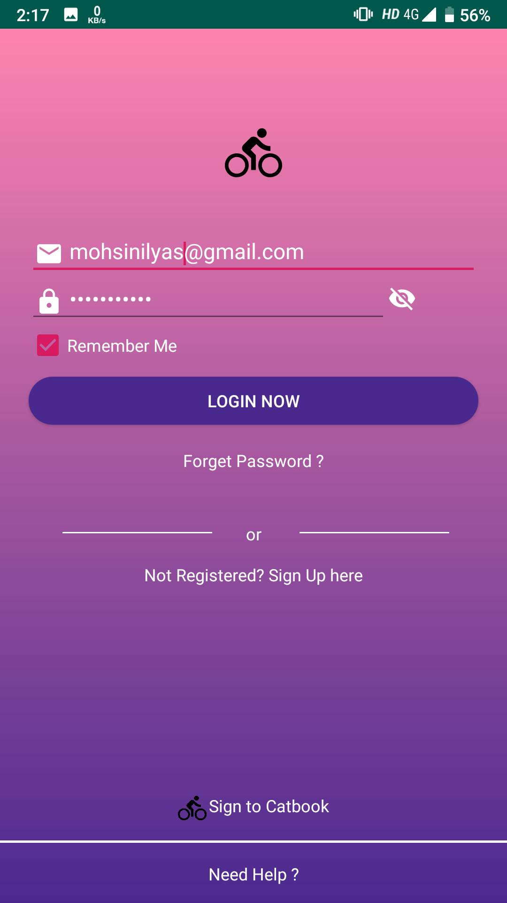
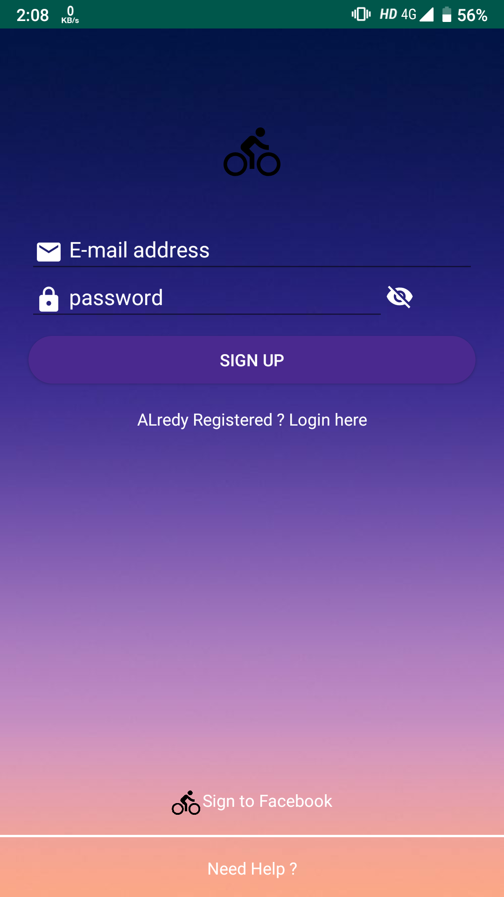
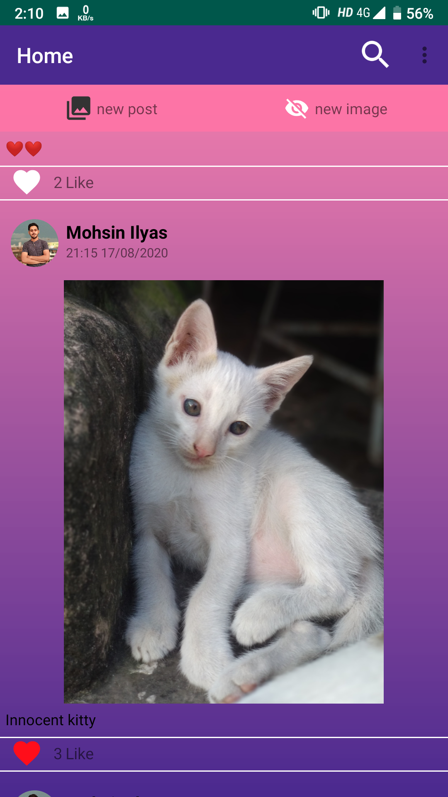
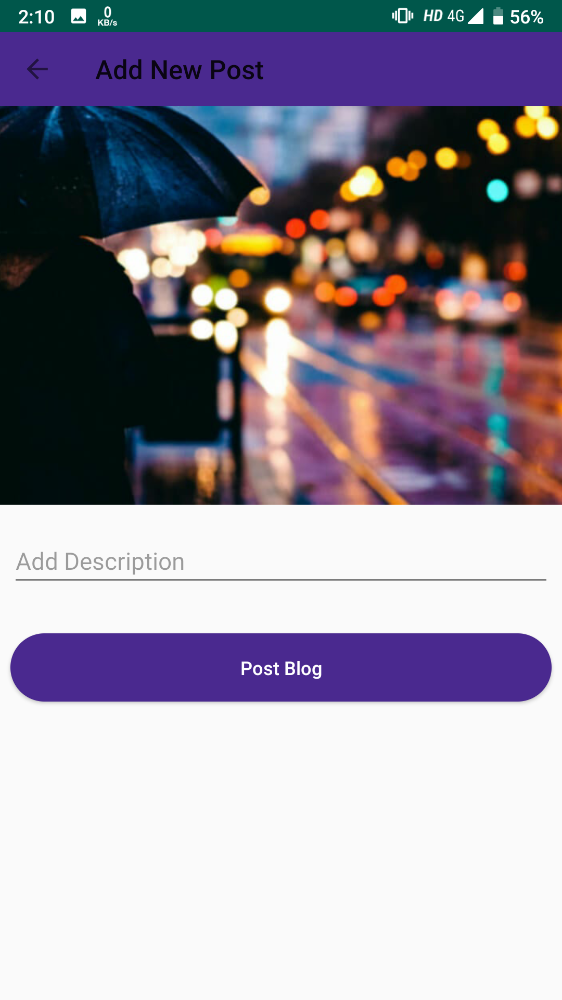
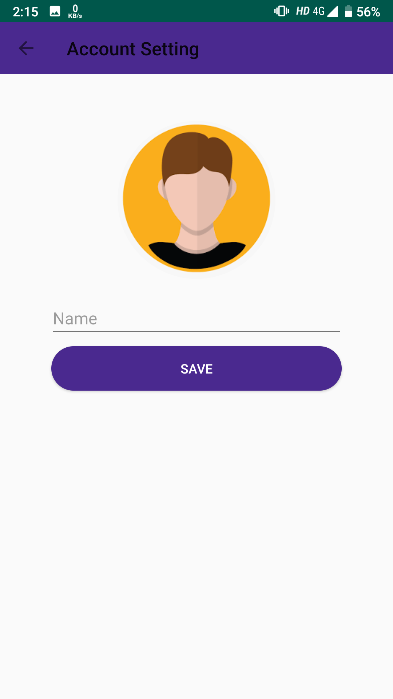

# Blog-app
<h3>Login Interface(MainActivity)</h3>
 
<h3>Sign Up Interface(SignInActivity)</h3>

<h3>Home Interface(HomeActivity)</h3>

<h3>Add New Post Interface(AddNewPostActivity)</h3>

<h3>Account Setting Interface(AccountSettingActivity)</h3>

